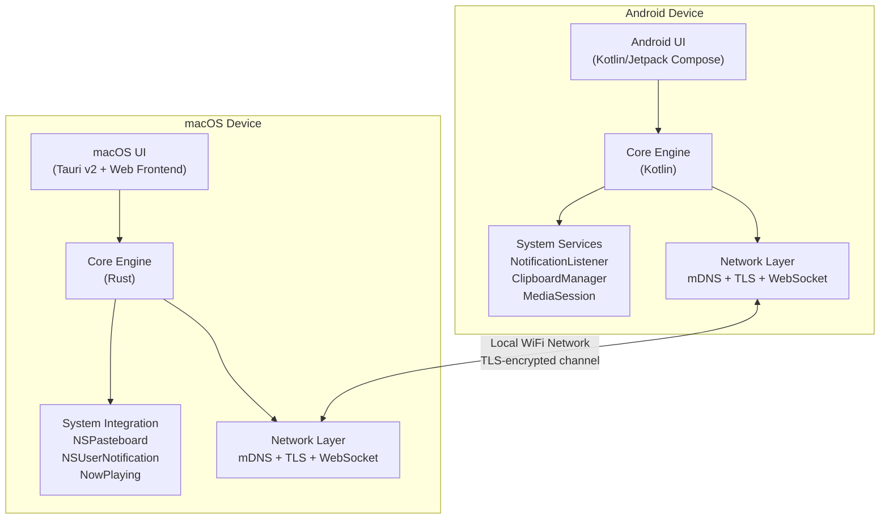
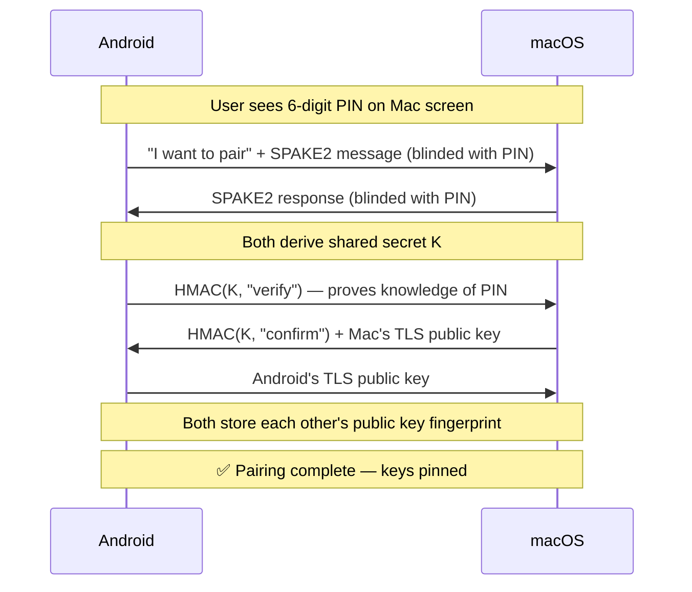
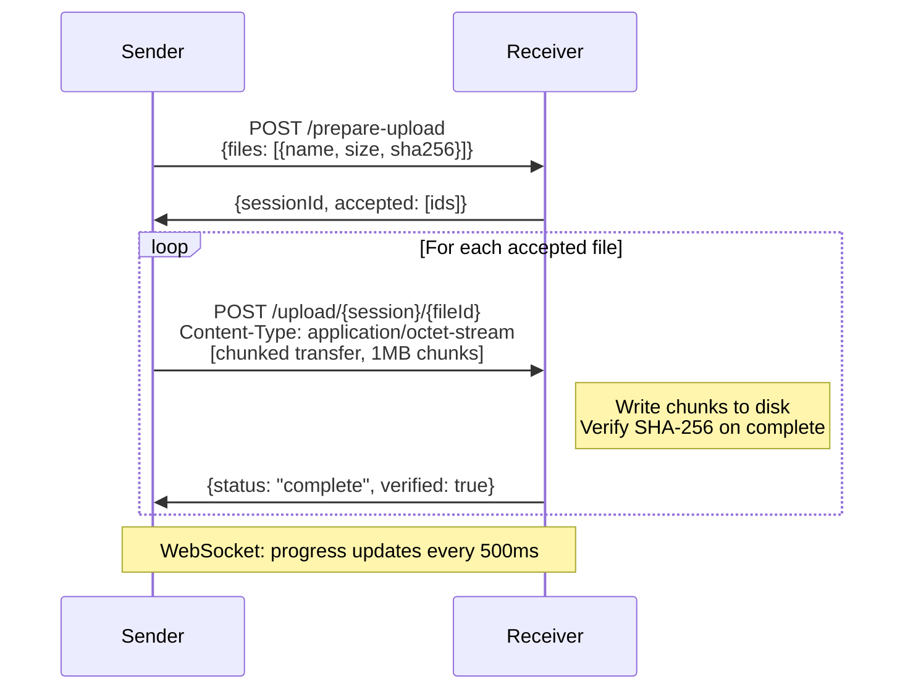
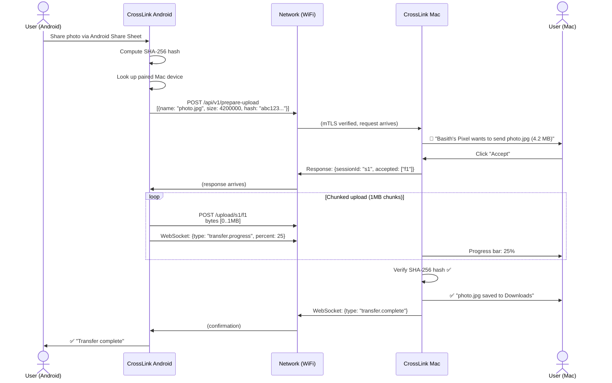

# 🌉 Mac ↔ Android Ecosystem Bridge — Technical Deep Dive & Implementation Plan

> **Project Codename:** *CrossLink*
> **Goal:** Build an open-source, privacy-first ecosystem that seamlessly connects macOS and Android — covering file transfer, clipboard sync, notification mirroring, media control, and more.

---

## 1. The Problem Space

Apple users get AirDrop, Handoff, Universal Clipboard, iCloud sync. Google/Samsung users get Nearby Share, Phone Link (Windows only), Google Drive sync. But if you're a **Mac + Android** user, you're stranded in no-man's land:

| Feature | Apple Ecosystem | Google Ecosystem | Mac + Android 😢 |
|---|---|---|---|
| File Transfer | AirDrop | Quick Share | ❌ Manual (USB/email) |
| Clipboard Sync | Universal Clipboard | Chrome sync (limited) | ❌ Nothing |
| Notification Mirror | iPhone → Mac native | Phone Link (Windows) | ❌ Nothing |
| SMS/Messages | iMessage on Mac | Messages (Windows) | ❌ Nothing |
| Media Control | Remote control via Handoff | — | ❌ Nothing |
| Find My Device | Find My | Find My Device | ❌ Separate apps |

### Existing Solutions & Their Gaps

| Tool | Strengths | Weaknesses |
|---|---|---|
| **LocalSend** | Great file transfer, open-source | File transfer only — no ecosystem |
| **KDE Connect** | Full ecosystem, plugin-based | macOS support is buggy, UI feels dated |
| **Soduto** | KDE Connect port for Mac | Abandoned, missing features |
| **AirDroid** | Polished UI | Cloud-reliant, privacy concerns, freemium |
| **Snapdrop/PairDrop** | Browser-based, zero install | File transfer only, needs browser open |

**Our opportunity:** Build something with KDE Connect's *breadth* + LocalSend's *reliability* + a *modern, polished* UX — specifically engineered for the Mac + Android pairing.

---

## 2. High-Level Architecture



### Why This Split?

- **Android side → Native Kotlin app**: Android requires deep system access (NotificationListenerService, AccessibilityService, MediaSession API). A native app is the *only* way to get this level of integration.
- **macOS side → Tauri v2 (Rust + Web UI)**: Tauri gives us native Rust performance for networking/crypto while allowing a beautiful web-based UI. The Rust backend can call macOS system APIs via `objc2` or Swift bridging.

---

## 3. Protocol Design — The Core Technical Knowledge

This is the heart of the system. Every feature rides on top of this protocol layer.

### 3.1 Device Discovery — mDNS/DNS-SD

**What:** Multicast DNS lets devices advertise services on a local network without a central server.

**How it works:**
```
┌─────────────┐                              ┌─────────────┐
│   Android    │  ── mDNS multicast ──────►   │    macOS     │
│              │     "_crosslink._tcp"         │              │
│  Advertises: │     port: 53317              │  Discovers:  │
│  device name │     fingerprint: a3f2...     │  device list │
│  device type │                              │              │
└─────────────┘  ◄── mDNS response ────────  └─────────────┘
```

**Technical details:**
- **Service type:** `_crosslink._tcp.local.`
- **TXT record fields:**
  - `fn` = Fingerprint (SHA-256 of device's TLS public key, first 8 hex chars)
  - `dn` = Device name ("Basith's Pixel 9")
  - `dt` = Device type (`android` | `macos`)
  - `pv` = Protocol version (`1`)
  - `port` = HTTPS server port (default `53317`)

**Platform APIs:**
| Platform | API | Notes |
|---|---|---|
| macOS | `NWBrowser` / `NWListener` (Network.framework) | Modern replacement for `NSNetService`. Handles both advertising and browsing. |
| Android | `NsdManager` | Built into Android SDK. Register/discover services. |

**Code Concept — macOS (Swift bridged via Rust):**
```swift
// Advertise our service
let listener = try NWListener(using: .tcp, on: 53317)
listener.service = NWListener.Service(
    name: "Basith's MacBook",
    type: "_crosslink._tcp",
    txtRecord: NWTXTRecord([
        "fn": fingerprint,
        "dt": "macos",
        "pv": "1"
    ])
)
listener.start(queue: .main)
```

**Code Concept — Android (Kotlin):**
```kotlin
val serviceInfo = NsdServiceInfo().apply {
    serviceName = "Basith's Pixel"
    serviceType = "_crosslink._tcp."
    port = 53317
    setAttribute("fn", fingerprint)
    setAttribute("dt", "android")
    setAttribute("pv", "1")
}
nsdManager.registerService(serviceInfo, NsdManager.PROTOCOL_DNS_SD, registrationListener)
```

**Fallback:** If mDNS fails (some enterprise networks block multicast), allow **manual IP entry** as a fallback.

---

### 3.2 Security Model — Pairing & Encryption

This is the most critical technical layer. We handle security in three phases:

#### Phase 1: Initial Pairing (SPAKE2 + PIN)



**Why SPAKE2?**
- The 6-digit PIN is low-entropy (only ~20 bits). If we used a simple Diffie-Hellman exchange, an eavesdropper could brute-force the PIN offline.
- SPAKE2 is specifically designed for low-entropy passwords — it's a **Password-Authenticated Key Exchange** that prevents offline dictionary attacks.
- Used by Google in FIDO2/WebAuthn and Bluetooth LE Secure Connections.

#### Phase 2: Self-Signed TLS Certificates

Each device generates a self-signed TLS certificate at first launch:

```
┌──────────────────────────────────┐
│  Certificate Generation          │
│                                  │
│  1. Generate Ed25519 key pair    │
│  2. Create X.509 self-signed     │
│     cert (valid 10 years)        │
│  3. Fingerprint = SHA-256(pubkey)│
│  4. Store in secure keychain     │
│     (macOS Keychain /            │
│      Android Keystore)           │
└──────────────────────────────────┘
```

**Why self-signed?** There's no CA for local networks. Instead, we use **Trust-on-First-Use (TOFU)** — during pairing, you verify the fingerprint via the PIN exchange, then pin that certificate forever.

#### Phase 3: Ongoing Connections (Mutual TLS)

After pairing, every connection uses **mutual TLS (mTLS)**:
- Both sides present their certificate
- Both sides verify the peer's cert matches the pinned fingerprint from pairing
- Any MITM attempt fails because the attacker can't forge the pinned key

```
┌─────────┐                         ┌─────────┐
│ Android  │──── TLS ClientHello ───►│  macOS   │
│          │◄─── TLS ServerHello ────│          │
│          │     + Server Cert       │          │
│ Verify:  │                         │ Verify:  │
│ cert.fp  │──── Client Cert ───────►│ cert.fp  │
│ == pinned│                         │ == pinned│
│    ✅    │◄─── TLS Finished ──────│    ✅    │
│          │                         │          │
│          │==== Encrypted channel ==│          │
└─────────┘                         └─────────┘
```

---

### 3.3 Communication Channels

We use **two parallel channels** between paired devices:

| Channel | Protocol | Purpose | When |
|---|---|---|---|
| **REST API** | HTTPS (over mTLS) | File transfer, large payloads | On-demand requests |
| **Real-time** | WebSocket (over mTLS) | Clipboard, notifications, media, ping | Always-on persistent connection |

#### REST API Endpoints (HTTPS)

```
POST /api/v1/prepare-upload
  → Sender announces files: [{name, size, type, hash}]
  ← Receiver responds: {sessionId, accepted: [fileIds]}

POST /api/v1/upload/{sessionId}/{fileId}
  → Sender streams file bytes (chunked transfer encoding)
  ← Receiver responds: {status: "ok", bytesReceived}

GET  /api/v1/download/{sessionId}/{fileId}
  → Receiver pulls file from sender
  ← Sender streams file bytes
```

#### WebSocket Messages (JSON packets)

Every WebSocket message follows this envelope:

```json
{
  "type": "clipboard.update",
  "id": "msg-uuid-here",
  "timestamp": 1719072000,
  "payload": {
    "content": "Hello from Android!",
    "contentType": "text/plain"
  }
}
```

**Message types:**
```
clipboard.update     — New clipboard content
clipboard.request    — Request current clipboard from peer
notification.new     — New notification appeared
notification.dismiss — Notification was dismissed
notification.action  — User took action on mirrored notification
media.state          — Now playing info changed
media.command        — Play/pause/next/prev
ping.request         — "Ring my phone" / "Find my device"
ping.response        — Acknowledgement with location (optional)
battery.status       — Battery level + charging state
device.status        — Online/offline heartbeat
```

---

## 4. Feature Modules — Technical Breakdown

Each feature is a **plugin module** that hooks into the protocol layer.

### 4.1 📁 File Transfer

The flagship feature. Must handle everything from a 2KB screenshot to a 50GB video folder.

#### Architecture



**Key technical decisions:**

| Decision | Choice | Why |
|---|---|---|
| Chunk size | 1 MB | Balances memory usage vs. overhead. Too small = too many HTTP round-trips. Too large = memory pressure on mobile. |
| Integrity | SHA-256 per file | Verify complete file after all chunks received. Sender computes hash before sending, receiver verifies after writing. |
| Resume | Byte-range headers | If transfer interrupts, receiver reports `bytesReceived`, sender resumes from that offset using `Range` header. |
| Compression | None (optional gzip for text) | Most files (images, videos, archives) are already compressed. Compressing them wastes CPU for zero gain. Text files optionally gzip'd. |
| Concurrency | 3 parallel file streams | Transfer up to 3 files simultaneously to maximize throughput on fast WiFi. |

**Speed targets:**
- WiFi 5 (802.11ac): ~40-60 MB/s achievable
- WiFi 6 (802.11ax): ~80-120 MB/s achievable
- The bottleneck is almost always the phone's storage write speed, not the network

---

### 4.2 📋 Clipboard Sync

Copy on one device → instantly available to paste on the other.

#### How It Works

```
┌──────────────────────────────────────────────────────────┐
│  Android Side                                            │
│                                                          │
│  ClipboardManager.OnPrimaryClipChangedListener           │
│       │                                                  │
│       ▼                                                  │
│  Debounce (500ms) ── prevent duplicate events            │
│       │                                                  │
│       ▼                                                  │
│  Check: is this OUR paste? (ignore echo)                 │
│       │                                                  │
│       ▼                                                  │
│  Encrypt content with session key                        │
│       │                                                  │
│       ▼                                                  │
│  WebSocket → {type: "clipboard.update", payload: {...}}  │
└──────────────────────────────────────────────────────────┘

                        │
                        ▼

┌──────────────────────────────────────────────────────────┐
│  macOS Side                                              │
│                                                          │
│  Receive WebSocket message                               │
│       │                                                  │
│       ▼                                                  │
│  Decrypt content                                         │
│       │                                                  │
│       ▼                                                  │
│  Set flag: "this is a remote paste" (prevent echo)       │
│       │                                                  │
│       ▼                                                  │
│  NSPasteboard.general.setString(content)                 │
│       │                                                  │
│       ▼                                                  │
│  Show subtle toast: "📋 Clipboard synced from Android"   │
└──────────────────────────────────────────────────────────┘
```

**Technical challenges:**

| Challenge | Solution |
|---|---|
| **Echo loop** — Device A copies → sends to B → B sets clipboard → B detects change → sends back to A → infinite loop | Each device tags outgoing pastes with a UUID. When receiving, check if the content matches the last *sent* UUID. If yes, it's an echo — ignore it. |
| **Android clipboard access in background** | Android 10+ restricts clipboard reads in the background. Options: (1) Use an `AccessibilityService` (requires user permission), or (2) Only sync when app is in foreground + use a persistent notification shortcut. |
| **Rich content (images)** | For images copied to clipboard, serialize as base64 or transfer via the file transfer API with a `clipboard.update` referencing the file. Cap at 10MB to prevent accidental large transfers. |
| **Sensitive content** | Detect if clipboard contains a password (e.g., from a password manager using `ClipDescription.EXTRA_IS_SENSITIVE`). If so, don't sync — show a notification instead: "Sensitive clipboard content not synced." |

---

### 4.3 🔔 Notification Mirroring

See your Android notifications on your Mac. Reply to messages without touching your phone.

#### Android Side — Capturing Notifications

```kotlin
class CrossLinkNotificationService : NotificationListenerService() {

    override fun onNotificationPosted(sbn: StatusBarNotification) {
        val notification = sbn.notification
        val extras = notification.extras

        val packet = NotificationPacket(
            id = sbn.key,
            appName = getAppName(sbn.packageName),
            appIcon = getAppIcon(sbn.packageName)?.toBase64(),
            title = extras.getCharSequence(Notification.EXTRA_TITLE)?.toString(),
            text = extras.getCharSequence(Notification.EXTRA_TEXT)?.toString(),
            timestamp = sbn.postTime,
            actions = notification.actions?.map { action ->
                ActionInfo(
                    label = action.title.toString(),
                    isReply = action.remoteInputs?.isNotEmpty() == true
                )
            },
            isOngoing = notification.flags and Notification.FLAG_ONGOING_EVENT != 0
        )

        // Send over WebSocket
        webSocketClient.send(packet.toJson())
    }

    override fun onNotificationRemoved(sbn: StatusBarNotification) {
        webSocketClient.send(DismissPacket(id = sbn.key).toJson())
    }
}
```

#### macOS Side — Displaying Notifications

```swift
// Using UserNotifications framework
let content = UNMutableNotificationContent()
content.title = "\(packet.appName): \(packet.title)"
content.body = packet.text
content.categoryIdentifier = "ANDROID_NOTIFICATION"
content.userInfo = ["androidNotifId": packet.id]

// If has reply action, add text input
if packet.actions.any { $0.isReply } {
    let replyAction = UNTextInputNotificationAction(
        identifier: "REPLY",
        title: "Reply",
        textInputButtonTitle: "Send",
        textInputPlaceholder: "Type a reply..."
    )
    // Register category with action
}

let request = UNNotificationRequest(
    identifier: packet.id,
    content: content,
    trigger: nil // Deliver immediately
)
UNUserNotificationCenter.current().add(request)
```

**Replying flow:**
```
Mac user types reply in notification → macOS sends WebSocket message →
Android receives → finds the original notification's RemoteInput →
fills in the reply text → fires the PendingIntent → message sent!
```

---

### 4.4 🎵 Media Control

Control what's playing on your Android from your Mac's keyboard/touch bar, and see the now-playing info.

```
Android MediaSession API                    macOS Now Playing
┌──────────────────────┐                   ┌──────────────────────┐
│  Spotify playing     │                   │  Menu bar widget     │
│  Song: "Blinding     │ ── WebSocket ──►  │  🎵 Blinding Lights  │
│         Lights"      │    media.state    │     The Weeknd       │
│  Artist: The Weeknd  │                   │  ◄◄  ▶️  ►►          │
│  Album Art: [bytes]  │                   │                      │
│                      │ ◄── WebSocket ──  │  User clicks ►►      │
│  Skip to next track  │    media.command  │                      │
└──────────────────────┘    {cmd: "next"}  └──────────────────────┘
```

---

### 4.5 📱 SMS Relay (Stretch Goal)

Read and send SMS from your Mac through your Android phone.

**Android side:** Uses the `Telephony` API + `BroadcastReceiver` for `SMS_RECEIVED`.
**macOS side:** A Messages-like UI in the Tauri app.

> [!WARNING]
> This is the most complex feature. Requires `READ_SMS`, `SEND_SMS`, `READ_CONTACTS` permissions on Android. Should be opt-in only.

---

## 5. Technology Stack & Framework Choices

### macOS App — Tauri v2

| Layer | Technology | Justification |
|---|---|---|
| **UI** | Svelte 5 + TypeScript | Svelte compiles to minimal JS, perfect for Tauri's WebView. Reactive, fast, small bundle. |
| **Backend** | Rust | Memory-safe, blazing fast networking & crypto. Tauri's native language. |
| **Networking** | `tokio` + `rustls` + `axum` | Async runtime + TLS + HTTP server. Industry-standard Rust web stack. |
| **WebSocket** | `tokio-tungstenite` | Async WebSocket implementation, works perfectly with tokio. |
| **mDNS** | `mdns-sd` crate | Pure Rust mDNS/DNS-SD implementation. |
| **Crypto** | `ring` or `rustls` + `spake2` crate | SPAKE2 for pairing, ring for AES-256-GCM encryption. |
| **System APIs** | `objc2` crate or Swift plugin | Access NSPasteboard, UserNotifications, NowPlaying via Objective-C bridging. |

### Android App — Native Kotlin

| Layer | Technology | Justification |
|---|---|---|
| **UI** | Jetpack Compose + Material 3 | Modern, declarative, Google-recommended UI toolkit. |
| **Networking** | Ktor Client + OkHttp | Kotlin-native HTTP/WebSocket. OkHttp for TLS configuration. |
| **mDNS** | `NsdManager` (Android SDK) | Built-in, no library needed. |
| **Background** | Foreground Service + WorkManager | Required for persistent WebSocket connection on modern Android. |
| **Notifications** | `NotificationListenerService` | System API for intercepting all notifications. |
| **Crypto** | Android Keystore + Tink | Hardware-backed key storage. Tink for SPAKE2 and AES-GCM. |
| **Storage** | Room Database | Store paired devices, transfer history, message cache. |

---

## 6. Data Flow — Complete Transfer Lifecycle

Here's what happens when you share a photo from Android to Mac, end-to-end:



---

## 7. Handling Real-World Challenges

### 7.1 Network Resilience

| Scenario | How We Handle It |
|---|---|
| **WiFi disconnect mid-transfer** | WebSocket has heartbeat (ping every 15s). On disconnect, retry connection with exponential backoff (1s, 2s, 4s, 8s, max 30s). File transfers resume from last acknowledged byte. |
| **Device sleeps** | Android: Foreground Service with `WAKE_LOCK` keeps connection alive. macOS: Use `IOPMAssertionCreateWithName` to prevent sleep during active transfers. |
| **Switch WiFi networks** | mDNS re-discovery triggers automatically. WebSocket reconnects. Paired device identity verified by TLS cert — no re-pairing needed. |
| **Hotspot mode** | If phone is the hotspot, Mac connects to phone's network. mDNS still works. We detect this scenario and adjust discovery. |

### 7.2 Battery & Performance

| Concern | Mitigation |
|---|---|
| **Always-on WebSocket drains battery** | On Android, batch non-urgent messages. Use `BATTERY_LOW` broadcast to reduce sync frequency. WebSocket ping interval increases from 15s to 60s on low battery. |
| **Large file transfer heats phone** | Throttle to 3 concurrent streams max. Monitor device temperature via `BatteryManager.EXTRA_TEMPERATURE`. If > 40°C, reduce to 1 stream. |
| **Background CPU usage** | All crypto operations use hardware acceleration (Android Keystore, Apple Secure Enclave). Clipboard polling replaced with event-driven listeners. |

### 7.3 Privacy & Security Guarantees

> [!IMPORTANT]
> **Zero cloud. Zero accounts. Zero telemetry.**

| Guarantee | Implementation |
|---|---|
| **Data never leaves LAN** | No internet servers involved. All traffic is device-to-device over local WiFi. |
| **No accounts required** | Pairing is done via local PIN exchange. No email, no login, no sign-up. |
| **End-to-end encrypted** | All data encrypted with AES-256-GCM. Keys derived from SPAKE2 pairing. Even if someone captures WiFi packets, they see only encrypted blobs. |
| **Open source** | Full source code auditable. No hidden data collection. |
| **Notification content protection** | Sensitive notifications (banking, passwords) can be filtered by app package name. User configures which apps to mirror. |

---

## 8. Project Structure

```
crosslink/
├── mac-app/                          # Tauri v2 macOS application
│   ├── src-tauri/                    # Rust backend
│   │   ├── src/
│   │   │   ├── main.rs
│   │   │   ├── discovery/            # mDNS module
│   │   │   │   ├── mod.rs
│   │   │   │   └── mdns_browser.rs
│   │   │   ├── security/             # TLS, SPAKE2, crypto
│   │   │   │   ├── mod.rs
│   │   │   │   ├── certificate.rs
│   │   │   │   ├── pairing.rs
│   │   │   │   └── keystore.rs
│   │   │   ├── transfer/             # File transfer engine
│   │   │   │   ├── mod.rs
│   │   │   │   ├── sender.rs
│   │   │   │   ├── receiver.rs
│   │   │   │   └── chunker.rs
│   │   │   ├── plugins/              # Feature modules
│   │   │   │   ├── clipboard.rs
│   │   │   │   ├── notifications.rs
│   │   │   │   ├── media_control.rs
│   │   │   │   └── sms_relay.rs
│   │   │   ├── server.rs             # HTTPS + WebSocket server (axum)
│   │   │   └── protocol.rs           # Message types & serialization
│   │   ├── Cargo.toml
│   │   └── tauri.conf.json
│   └── src/                          # Svelte frontend
│       ├── App.svelte
│       ├── lib/
│       │   ├── components/
│       │   │   ├── DeviceList.svelte
│       │   │   ├── FileTransfer.svelte
│       │   │   ├── NotificationPanel.svelte
│       │   │   └── MediaControl.svelte
│       │   └── stores/
│       │       ├── devices.ts
│       │       ├── transfers.ts
│       │       └── settings.ts
│       └── styles/
│           └── global.css
│
├── android-app/                      # Native Android application
│   └── app/src/main/
│       ├── java/com/crosslink/
│       │   ├── MainActivity.kt
│       │   ├── core/
│       │   │   ├── CrossLinkService.kt       # Foreground service
│       │   │   ├── DiscoveryManager.kt       # NsdManager wrapper
│       │   │   ├── ConnectionManager.kt      # TLS + WebSocket
│       │   │   └── PairingManager.kt         # SPAKE2 flow
│       │   ├── transfer/
│       │   │   ├── FileSender.kt
│       │   │   ├── FileReceiver.kt
│       │   │   └── TransferSession.kt
│       │   ├── plugins/
│       │   │   ├── ClipboardPlugin.kt
│       │   │   ├── NotificationPlugin.kt
│       │   │   ├── MediaPlugin.kt
│       │   │   └── SmsPlugin.kt
│       │   ├── services/
│       │   │   ├── CrossLinkNotificationListener.kt
│       │   │   └── CrossLinkAccessibilityService.kt
│       │   └── data/
│       │       ├── PairedDevice.kt
│       │       ├── TransferHistory.kt
│       │       └── AppDatabase.kt
│       ├── res/
│       └── AndroidManifest.xml
│
└── shared-protocol/                  # Protocol specification
    ├── PROTOCOL.md                   # Human-readable spec
    ├── schema/                       # JSON schemas for messages
    │   ├── clipboard.schema.json
    │   ├── notification.schema.json
    │   ├── transfer.schema.json
    │   └── media.schema.json
    └── test-vectors/                 # Crypto test vectors
        ├── spake2_vectors.json
        └── tls_vectors.json
```

---

## 9. Phased Implementation Roadmap

### Phase 1: Foundation (Weeks 1–3)
- [ ] Set up Tauri v2 project (macOS) + Android Studio project
- [ ] Implement mDNS discovery on both platforms
- [ ] Implement TLS certificate generation & storage
- [ ] Implement SPAKE2 pairing flow
- [ ] Basic WebSocket connection between paired devices
- [ ] Heartbeat / connection status

### Phase 2: File Transfer (Weeks 4–6)
- [ ] REST API server (Rust/axum on Mac, Ktor on Android)
- [ ] Chunked file upload/download with SHA-256 verification
- [ ] Resume interrupted transfers
- [ ] Progress UI on both platforms
- [ ] Android Share Sheet integration
- [ ] macOS drag-and-drop support

### Phase 3: Clipboard & Notifications (Weeks 7–9)
- [ ] Clipboard sync module (both directions)
- [ ] Echo loop prevention
- [ ] NotificationListenerService on Android
- [ ] macOS notification display with reply support
- [ ] App filtering (choose which apps to mirror)

### Phase 4: Media & Polish (Weeks 10–12)
- [ ] Media session info forwarding
- [ ] Mac media control (play/pause/skip)
- [ ] Battery status sharing
- [ ] "Find my device" ping
- [ ] Settings UI (auto-start, notification preferences, etc.)
- [ ] Performance optimization & battery testing

### Phase 5: Advanced Features (Post-launch)
- [ ] SMS relay
- [ ] Screen mirroring (stretch)
- [ ] Multi-device support (pair with multiple devices)
- [ ] Linux support (Tauri supports Linux natively)

---

## User Review Required

> [!IMPORTANT]
> **Scope Check:** This plan covers a full ecosystem app. Should we start with **just file transfer** (like a better LocalSend) and iterate, or do you want to tackle the full ecosystem from day one?

> [!IMPORTANT]
> **Framework Preference:** The plan uses **Tauri v2 (Rust)** for macOS and **native Kotlin** for Android. Are you comfortable with Rust, or would you prefer a different approach (e.g., Kotlin Multiplatform for shared logic, or Electron for the Mac app)?

## Open Questions

1. **Project name** — "CrossLink" is a placeholder. Do you have a name in mind?
2. **Target audience** — Is this for personal use, or do you want to build it as an open-source project for the community?
3. **Starting point** — Which feature excites you most? File transfer? Clipboard sync? Notifications? This will determine what we build first.
4. **Existing experience** — What's your familiarity level with Rust, Kotlin, and Tauri? This affects how we approach the implementation.
5. **Should we prototype first?** — We could build a quick web-based prototype (no native apps) to validate the file transfer protocol, then graduate to native apps.
