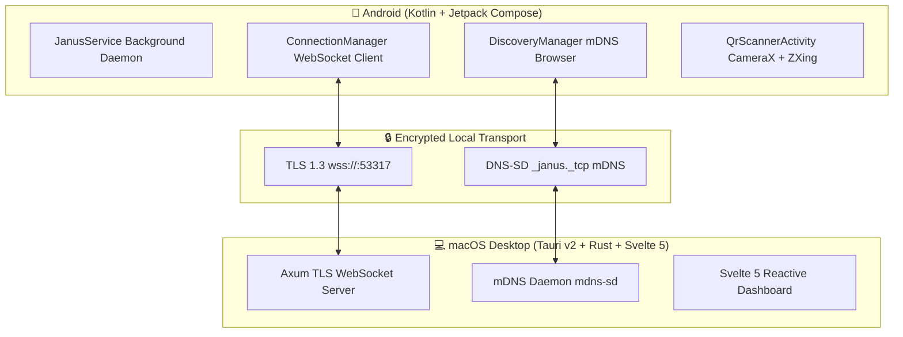

<div align="center">

```
     ██╗ █████╗ ███╗   ██╗██╗   ██╗███████╗
     ██║██╔══██╗████╗  ██║██║   ██║██╔════╝
     ██║███████║██╔██╗ ██║██║   ██║███████╗
██   ██║██╔══██║██║╚██╗██║██║   ██║╚════██║
╚█████╔╝██║  ██║██║ ╚████║╚██████╔╝███████║
 ╚════╝ ╚═╝  ╚═╝╚═╝  ╚═══╝ ╚═════╝ ╚══════╝
```

### **Ultra-Fast, Zero-Config macOS ⟷ Android Ecosystem Bridge**

*Seamless Continuity, Real-time P2P Clipboard, Screen Mirroring, Drag & Drop File Transfer, and Telemetry.*

---

[](https://www.rust-lang.org/)
[](https://tauri.app/)
[](https://svelte.dev/)
[](https://kotlinlang.org/)
[](https://github.com/Basithmd024/janus)
[](https://coderabbit.ai/)
[](LICENSE)

</div>

---

## 🌟 Overview

**Janus** transforms your Mac and Android phone into a unified Apple-like ecosystem experience. Built with **Rust, Tauri v2, Svelte 5, Kotlin, and Jetpack Compose**, it connects your devices over local Wi-Fi with **sub-millisecond latency** and **end-to-end TLS 1.3 encryption**.

No third-party cloud servers. No subscriptions. No accounts required.

---

## ⚡ Core Features

| Feature | Description |
| :--- | :--- |
| 📋 **Universal Clipboard** | Copy on Mac, paste on Android instantly — and vice versa |
| 📱 **Screen Mirror + Remote Control** | View and control your phone screen from Mac with mouse & keyboard |
| ⚡ **Fast File Drop** | Drag & drop files from Mac to Android over local Wi-Fi at 100MB/s+ |
| 🔔 **Notification Mirror** | Android notifications appear live on your Mac |
| 📞 **Call Hub + Dialer** | See incoming calls and dial numbers directly from your Mac |
| 📊 **Live Telemetry** | Real-time battery %, charging status, and signal bars on Mac |
| 💬 **SMS Viewer** | Read all your Android text messages from Mac |

---

## 🏗️ Architecture



---

## 🚀 Installation Guide

> **Requirements**: macOS 12 Monterey or later · Android 10 or later

---

### 📋 Step 1 — Install Prerequisites on Your Mac

You need to install these tools **once** before running Janus.

#### Node.js & npm
```bash
# Install via Homebrew
brew install node

# Verify it works
node --version    # Should show v18 or higher
npm --version
```
> Don't have Homebrew? Install it first: https://brew.sh

#### Rust & Cargo
```bash
# One-line Rust installer
curl --proto '=https' --tlsv1.2 -sSf https://sh.rustup.rs | sh

# After install, restart your terminal then verify
rustc --version
cargo --version
```

#### Xcode Command Line Tools
```bash
xcode-select --install
```

#### Android Studio (for building the Android APK)
1. Download from: https://developer.android.com/studio
2. Install and open Android Studio
3. Go to **Preferences → Appearance & Behavior → System Settings → Android SDK**
4. Make sure **Android API 33 (Android 13)** is installed

#### Add `adb` to your PATH permanently
```bash
echo 'export ANDROID_HOME="$HOME/Library/Android/sdk"' >> ~/.zshrc
echo 'export PATH="$ANDROID_HOME/platform-tools:$PATH"' >> ~/.zshrc
source ~/.zshrc

# Verify
adb --version
```

---

### 💻 Step 2 — Download & Run the Mac Desktop App

```bash
# Clone the repository
git clone https://github.com/Basithmd024/janus.git
cd janus

# Install JavaScript dependencies
npm install

# Launch the Mac Desktop Command Center
npm run tauri dev
```

> ✅ The animated Janus intro splash will appear, followed by the Device Command Center dashboard!

**Optional — Build a standalone `.app` file to distribute:**
```bash
npm run tauri build
# Output: src-tauri/target/release/bundle/macos/Janus.app
```

---

### 📱 Step 3 — Build & Install the Android App

#### Build the APK
```bash
# From inside the janus directory
cd android-app
./gradlew assembleDebug
```

APK is now ready at:
```
android-app/app/build/outputs/apk/debug/app-debug.apk
```

#### Install on Your Phone

**Option A: Via USB Cable** *(Recommended — 5 seconds)*

1. On your Android phone: **Settings → About phone → tap Build number 7 times** (enables Developer Mode)
2. **Settings → Developer Options → turn ON USB Debugging**
3. Plug your phone into your Mac via USB
4. Run:
```bash
adb install -r android-app/app/build/outputs/apk/debug/app-debug.apk
```

**Option B: Transfer the APK file manually** *(No cable needed)*

1. Find the APK on your Mac:
   ```
   janus/android-app/app/build/outputs/apk/debug/app-debug.apk
   ```
2. Send it to your phone via **Google Drive, WhatsApp, Telegram, or AirDrop alternative**
3. On your phone — open your **Files app** → tap `app-debug.apk` → tap **Install**
4. If asked "Install from unknown sources" → tap **Settings** → enable **Install unknown apps** for your Files app

**Option C: Wireless ADB** *(Over Wi-Fi)*

1. On your phone: **Settings → Developer Options → Wireless debugging → Turn ON**
2. Tap **"Pair device with pairing code"** — note the **IP:Port** shown (e.g. `192.168.1.48:41234`)
3. On your Mac:
```bash
adb connect 192.168.1.48:41234
adb install -r android-app/app/build/outputs/apk/debug/app-debug.apk
```

---

### 🔗 Step 4 — Connect Mac & Android Together

1. **Connect both devices to the same network:**
   - Both on the same home Wi-Fi, **OR**
   - Turn ON **Personal Hotspot** on your Android → connect your Mac to it

2. **Open Janus on both devices:**
   - Mac: `npm run tauri dev` (inside the `janus` folder)
   - Android: Tap the **Janus** app icon on your phone

3. **Pair via QR Code:**
   - On your phone → **Devices tab** → tap **"Scan QR Code to Pair"**
   - Point your phone camera at the **QR code shown on your Mac**
   - Both devices will show 🟢 **Connected** instantly!

---

### ⚡ Alternative: One-Command Quick Installer

If you want to skip all manual steps:

```bash
git clone https://github.com/Basithmd024/janus.git
cd janus
chmod +x install.sh
./install.sh --all
```

| Command | What It Does |
| :--- | :--- |
| `./install.sh --all` | Build & install Android APK + Launch Mac app |
| `./install.sh --android` | Build & install Android APK only (via USB) |
| `./install.sh --skip-desktop` | Build APK, skip Mac desktop launch |

---

### 🔓 Android Permissions Setup (After Installing)

After installing the APK, grant these permissions so all features work:

**1. Allow Restricted Settings** *(Required for Remote Control)*
- Long-press **Janus icon** on home screen → **App info (ℹ️)**
- Tap **3 dots (⋮)** top-right → tap **"Allow restricted settings"**
- Confirm with your PIN / Fingerprint

**2. Enable Accessibility** *(Required for Remote Control)*
- Settings → Accessibility → **Janus Remote Control** → Turn **ON**

**3. Enable Call & SMS Permissions**
- Settings → Apps → Janus → **Permissions**
- Allow: **Call logs**, **Contacts**, **SMS**, **Notifications**

---

## 🔒 Security & Privacy

- ✅ **Zero Cloud** — All data stays on your local network. Nothing goes to external servers.
- ✅ **TLS 1.3 Encrypted** — Every WebSocket connection uses TLS 1.3 encryption.
- ✅ **SHA-256 Fingerprint Pinning** — Devices verify each other's certificate on first connect.
- ✅ **Memory-Safe** — Rust backend prevents buffer overflows and race conditions by design.

---

## 🧪 Running Tests

```bash
# Rust backend tests
cargo test --no-default-features

# Svelte frontend typecheck
npx svelte-check --tsconfig ./tsconfig.json

# Android unit tests
cd android-app
./gradlew testDebugUnitTest
```

---

## 📡 WebSocket Packet Registry

| Packet Type | Direction | Description |
| :--- | :--- | :--- |
| `device.register` | Android → Mac | Initial handshake |
| `registration.success` | Mac → Android | Connection confirmed |
| `device.ready` | Android → Mac | Explicit connected return statement |
| `device.status` | Android → Mac | Battery, charging, signal telemetry |
| `device.unpaired` | Mac → Android | Forget device (pauses auto-reconnect) |
| `clipboard.update` | Bidirectional | Live clipboard sync |
| `notification.new` | Android → Mac | Mirrored Android notification |
| `call.incoming` | Android → Mac | Incoming call alert |
| `calls.list` | Android → Mac | Call history sync |
| `sms.list` | Android → Mac | SMS messages sync |
| `screencast.frame` | Android → Mac | Binary video stream frames |

---

## 📜 License

Distributed under the **MIT License**. See [LICENSE](LICENSE) for details.

---

<div align="center">
  <sub>Crafted with ❤️ by the Janus Core Team. Built for speed, privacy, and seamless computing.</sub>
</div>
