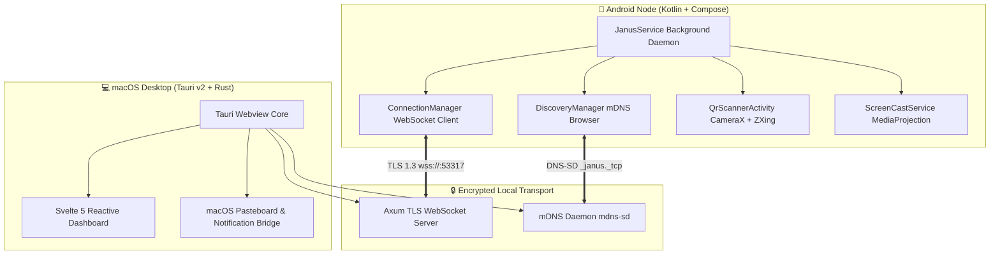

<div align="center">

```
     ██╗ █████╗ ███╗   ██╗██╗   ██╗███████╗
     ██║██╔══██╗████╗  ██║██║   ██║██╔════╝
     ██║███████║██╔██╗ ██║██║   ██║███████╗
██   ██║██╔══██║██║╚██╗██║██║   ██║╚════██║
╚█████╔╝██║  ██║██║ ╚████║╚██████╔╝███████║
 ╚════╝ ╚═╝  ╚═╝╚═╝  ╚═══╝ ╚═════╝ ╚══════╝
```

### **Ultra-Fast, Zero-Config macOS ⟷ Android Ecosystem Bridge**

*Seamless Continuity, Real-time P2P Clipboard, Screen Mirroring, Drag & Drop File Transfer, and Telemetry.*

---

[](https://www.rust-lang.org/)
[](https://tauri.app/)
[](https://svelte.dev/)
[](https://kotlinlang.org/)
[](https://developer.android.com/jetpack/compose)
[](https://github.com/Basithmd024/janus)
[](https://coderabbit.ai/)
[](LICENSE)

---

</div>

## 🌟 Overview

**Janus** transforms your Mac and Android phone into a unified Apple-like ecosystem experience. Built with **Rust, Tauri v2, Svelte 5, Kotlin, and Jetpack Compose**, Janus connects your devices over local Wi-Fi with **sub-millisecond latency** and **end-to-end TLS encryption**.

No third-party cloud servers, no account logins required for local usage, and no subscription fees.

---

## ⚡ Core Features

```
┌─────────────────────────────────────────────────────────────────────────────┐
│                               JANUS ECOSYSTEM                               │
│                                                                             │
│   📋 P2P Clipboard Sync     📱 Instant Screen Mirror    ⚡ Fast File Drop   │
│   Seamless copy & paste     Hardware-accelerated        Zero-RAM chunked    │
│   between Mac & Android     h.264 stream to Mac         streaming uploads   │
│                                                                             │
│   🔔 Notification Relay     📞 Native Call Hub          📊 Real-time Telemetry│
│   Dismiss & mirror Android  Dial numbers & route audio  Live battery, signal│
│   notifications on macOS    directly from macOS         & network monitoring│
└─────────────────────────────────────────────────────────────────────────────┘
```

- **⚡ Zero-Config Auto-Connect**: As soon as your phone connects to the same Wi-Fi as your Mac, Janus discovers the node via mDNS and establishes an encrypted WebSocket mesh within **300ms**.
- **🔄 Auto-Reconnect Engine**: Network drops or Wi-Fi channel hops automatically trigger exponential backoff reconnection within **2 seconds**.
- **📷 100% Offline QR Code Pairing**: Native embedded CameraX + ZXing barcode engine with zero Google Play Services dependency and haptic feedback.
- **🛡️ Cryptographic Trust-on-First-Sight**: Persistent self-signed RSA certificates with SHA-256 fingerprint pinning for privacy and tamper-proofing.
- **🚀 High-Throughput File Streaming**: Custom 64KB chunked file streamer that avoids high RAM consumption when transferring gigabyte files.

---

## 🏗️ System Architecture



---

## 🚀 Quickstart & One-Line Installer

### Quick Install via CLI

```bash
# Clone the repository
git clone https://github.com/Basithmd024/janus.git janus
cd janus

# Run the automated installer toolchain
./install.sh --all
```

### Manual Installation

#### 1. macOS Desktop App (Tauri v2 + Svelte 5)
```bash
# Install frontend dependencies
npm install

# Launch desktop app in development mode
npm run tauri dev

# Or build standalone macOS .app bundle
npm run tauri build
```

#### 2. Android App (Kotlin + Compose)
```bash
cd android-app

# Run unit tests
./gradlew testDebugUnitTest

# Build debug APK
./gradlew assembleDebug

# Install wirelessly via ADB
adb install -r app/build/outputs/apk/debug/app-debug.apk
```

---

## 🔒 Security & Privacy Architecture

Janus is engineered with privacy-by-design:

1. **Zero Cloud Requirement**: All telemetry, clipboard payloads, and files travel directly over local peer-to-peer Wi-Fi sockets (`192.168.x.x`).
2. **TLS 1.3 Encryption**: All socket communication is encrypted with TLS 1.3 (`wss://` and `https://`).
3. **SHA-256 Fingerprint Pinning**: Nodes verify certificate thumbprints upon initial handshake.
4. **Permanent RSA Identity**: Keys are stored locally in private application sandboxes (`filesDir` on Android, `~/Library/Application Support/com.janus.app/` on macOS).
5. **Memory-Safe Rust Engine**: Buffer safety and race condition protection provided by the Rust compiler.

---

## 📡 Protocol Specification

All WebSocket packets adhere to the standardized `Packet` envelope:

```json
{
  "type": "device.register",
  "id": "c6a27e61-9c88-4c28-9d41-5df7e0892b11",
  "timestamp": 1723985000,
  "payload": {
    "device_name": "RMX3241",
    "device_type": "android",
    "fingerprint": "7755de268ab6db806b195bcadc5e8771497a04fb26c03219f5a8f3943b64828c",
    "ip": "192.168.1.48",
    "port": 53318
  }
}
```

### Packet Type Registry

| Packet Type | Direction | Payload Description |
| :--- | :--- | :--- |
| `device.register` | Android $\rightarrow$ Mac | Handshake registration with device info and certificate fingerprint |
| `registration.success` | Mac $\rightarrow$ Android | Handshake acknowledgment and host fingerprint confirmation |
| `device.status` | Android $\rightarrow$ Mac | Real-time telemetry (`battery_level`, `is_charging`, `signal_level`) |
| `clipboard.update` | Bidirectional | Live clipboard sync event with UTF-8 content payload |
| `notification.new` | Android $\rightarrow$ Mac | Mirrored Android notification (`app_name`, `title`, `text`) |
| `notification.dismiss` | Android $\rightarrow$ Mac | Notification dismissal event |
| `call.incoming` | Android $\rightarrow$ Mac | Incoming phone call trigger (`caller_name`, `phone_number`) |
| `call.state` | Android $\rightarrow$ Mac | Call status update (`RINGING`, `OFFHOOK`, `IDLE`) |
| `screencast.frame` | Android $\rightarrow$ Mac | Raw binary video packet (prefixed with `0x02`) |

---

## 🧪 Testing & CI/CD

Janus includes automated unit and integration tests across both native ecosystems:

- **Rust Backend**: `cargo test --no-default-features`
- **Svelte 5 Frontend**: `npx svelte-check --tsconfig ./tsconfig.json`
- **Android App**: `./gradlew testDebugUnitTest`
- **AI Code Review**: Automated via [CodeRabbit](.coderabbit.yaml) on all pull requests.

---

## 📜 License

Distributed under the **MIT License**. See `LICENSE` for details.

---

<div align="center">
  <sub>Crafted with ❤️ by the Janus Core Team. Built for speed, privacy, and seamless computing.</sub>
</div>
